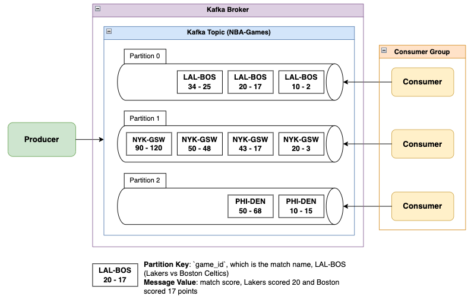

# Project Description

This project demonstrate fine-grained Kafka partitioning and consumer group coordination for streaming **real-time NBA game events**, built with Go and Apache Kafka.

# Apache Kafka Configuration

- Topic: `NBA-Games`
- **Partitioning Strategy**: Each active NBA game maps to a dedicated Kafka partition by using a hash function (i.e., `Balancer: &kafka.Hash{}`) in the **Producer**.
  - Partition 0 --> `LAL-BOS`
  - Partition 1 --> `NYK-GSW`
  - Partition 2 --> `PHI-DEN`
- **Partition Key**: `game_id`
  - Ensures consistent routing to the same partition using the `Hash` balancer.
- **Producer Server**:
  - Receives live score updates via `POST /score` API endpoint.
  - Writes Kafka messages with:
    - Key: `game_id`
    - Value: JSON-encoded score update
    - Partitioning targeting: Automatic via `Hash` balancer or manually mapped.
  - Connects to single instance kafka broker via `kafka:9092`
- **Consumer Group**:
  - Deployed 3 consumers and they join a **shared consumer group**.
  - Kafka distributes partitions to consumers dynamically, ensuring each partition is handled by only one consumer at a time.
    - Reference: https://codingharbour.com/apache-kafka/what-is-a-consumer-group-in-kafka/
  - Each consumer:
    - Deserializes messages
    - Processes events grouped by `game_id`
    - Can checkpoint or log scores per game.
  - Doing it like this also allows **parallel processing** via Kafka consumer groups.

# Project Architecture

- Key Challenges:
  - Events from different games must be isolated and ordered correctly.
  - The system must scale horizontally with the number of concurrent games.
  - Producers and consumers must be fault-tolerant and recoverable
- Kafka solves the challenges by:
  - Using **partitioning** to isolate events per game.
  - Allowing **parallel consumption** via Kafka consumer groups.
  - Providing **strong ordering guarantees** within partitions.
  - Offering **offset tracking**, retries and buffering built into the ecosystem.

# References

- Kafka Cluster on Kubernetes
  - [strimzi-kafka-operator github](https://github.com/strimzi/strimzi-kafka-operator)
  - [Strimzi Quick Start](https://strimzi.io/quickstarts/)
  - [Strimzi Overview](https://strimzi.io/docs/operators/latest/overview)
- Kafka Client on Golang
  - [segmentio/kafka-go github](https://github.com/segmentio/kafka-go)
