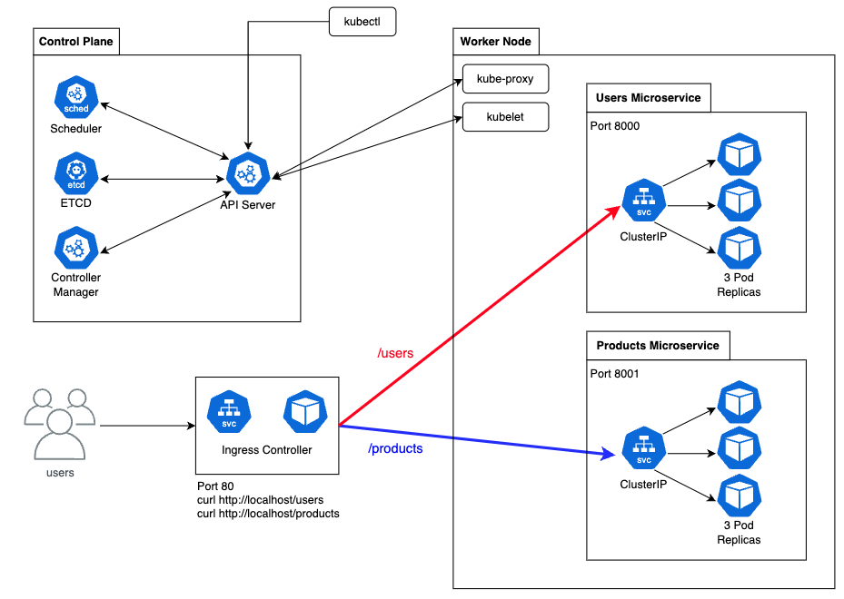

# Project Description

This project demonstrates how to route traffic to 2 different backend microservices - **users and products** - using Kubernetes `Ingress`.

Each microservice exposes its own API endpoint:

- `/users` --> routed to the users microservice
- `/products` --> routes to the products microservice

# Project Architecture

- Both microservices are deployed using Kubernetes `Deployment` objects, each running **3 Pod replicas**.
- Each deployment is fronted by a Kubernetes `Service` of type `ClusterIP`, which exposes the Pods internally within the cluster.
- An **Ingress Resource** defines routing rules that map `/users` and `/products` paths to the respective services.
- An **NGINX Ingress Controller** is deployed to handle incoming HTTP requests and apply the routing rules specified in the Ingress Resource.
  It watches for changes in the Ingress configuration and updates the routing dynamically.



# How to start the project?

```sh
# To deploy all manifest files
make apply
```

```sh
# To remove all k8s objects created
make clean
```

# References

- [Kubernetes Ingress Tutorial For Beginners](https://devopscube.com/kubernetes-ingress-tutorial/)
