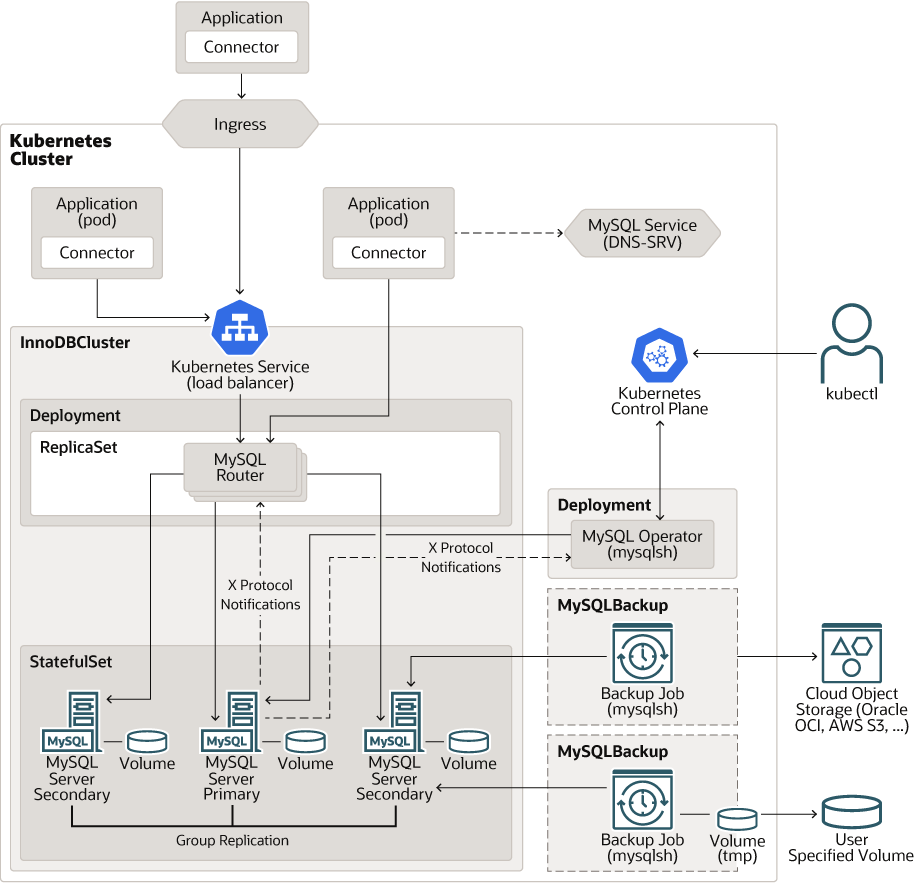
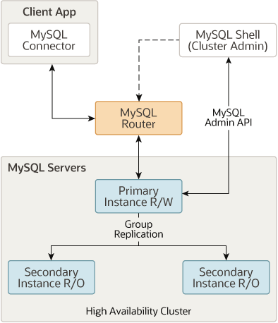

# Content

- [Project Setup]
- [Kubernetes Controllers](#kubernetes-controllers)
- [MySQL Operator for Kubernetes](#mysql-operator-for-kubernetes)
- [MySQL Operator Kubernetes Architecture](#mysql-operator-kubernetes-architecture)
- [MySQL InnoDB Cluster](#mysql-innodb-cluster)
- [References](#references)

# Project Setup

```sh
# Install CRD used by MySQL Operator
kubectl apply -f https://raw.githubusercontent.com/mysql/mysql-operator/trunk/deploy/deploy-crds.yaml

# Deploy MySQL Operator, includes RBAC definitions in output
kubectl apply -f https://raw.githubusercontent.com/mysql/mysql-operator/trunk/deploy/deploy-operator.yaml

# Verify operator is running
kubectl get deployment mysql-operator --namespace mysql-operator
## Expected Output:
# NAME             READY   UP-TO-DATE   AVAILABLE   AGE
# mysql-operator   1/1     1            1           37s

# Configure and install a new MySQL InnoDB CLuster
kubectl apply -f ./manifests
## Expected Output:
# innodbcluster.mysql.oracle.com/myinnodbcluster created
# secret/myinnodbcluster created

# (Optional) Observe the process by watching the `innodbcluster` type for the default namespace
kubectl get innodbcluster --watch
## Expected Output:
# NAME              STATUS    ONLINE   INSTANCES   ROUTERS   TYPE      AGE
# myinnodbcluster   PENDING   0        3           1         PRIMARY   62s
# myinnodbcluster   ONLINE   1        3           1         UNKNOWN   74s
# myinnodbcluster   ONLINE   2        3           1         UNKNOWN   76s
# myinnodbcluster   ONLINE   2        3           1         UNKNOWN   82s
# myinnodbcluster   ONLINE   3        3           1         UNKNOWN   87s

# Connect with MySQL Shell to check the host name
# This command connects to `myinnodbcluster` headless Service (created by MySQL Operator), 
# exposing all pods of the StatefulSet (e.g., `myinnodbcluster-0`, `-1`, `-2`).
kubectl run --rm -it myshell --image=container-registry.oracle.com/mysql/community-operator -- mysqlsh root@myinnodbcluster --sql
## Expected Output:
#  MySQL  myinnodbcluster:3306 ssl  SQL > select @@hostname;
# +-------------------+
# | @@hostname        |
# +-------------------+
# | myinnodbcluster-0 |
# +-------------------+
# 1 row in set (0.0021 sec)
## This shows a successful connection that was routed to the myinnodbcluster-0 pod in the 
## MySQL InnoDB Cluster. It connects to `-0` pod because only one pod is elected as the primary (writer),
## usually the first one, myinnodbcluster-0, others (-1, -2) are replicas (read-only by default).
```

# Kubernetes Controllers

- k8s uses **Controllers** to manage the lifecycle of containerized workloads by running them as Pods in the Kubernetes system.
- Controllers provide capabilities for a broad range of services, but complex services require additional components and this includes **operators**.
- Operator
  - An [Operator](https://kubernetes.io/docs/concepts/extend-kubernetes/operator/) is software running inside the Kubernetes cluster.
  - The operator interacts with the **Kubernetes API** to observe resources and services to assist Kubernetes with life-cycle management.

# MySQL Operator for Kubernetes

- MySQL Operator focuses on managing 1 or more [MySQL InnoDB Clusters](https://dev.mysql.com/doc/refman/9.2/en/mysql-innodb-cluster-introduction.html) which consists of a group of:
  - MySQL Servers
  - MySQL Routers
- MySQL Operator itself runs in a Kubernetes cluster and is controlled by a Kubernetes `Deployment` to ensure that the MySQL Operator remains available and running.
- MySQL Operator is deployed in `mysql-operator` Kubernetes namespace by default. It **watches all InnoDB Clusters** and related resources in the Kubernetes cluster.
  - To perform these tasks, the operator
    - subscribes to the Kubernetes API server to update events
    - connects to the managed MySQL Server instance as needed
- On top of the Kubernetes controllers, the operator configures the MySQL servers, replication using MySQL Group Replication, and MySQL Router.
- MySQL Operator for Kubernetes requires 3 container images to function:
  - MySQL Operator for Kubernetes
  - MySQL Router
  - MySQL Server

# MySQL Operator Kubernetes Architecture

<p align="center">
  
</p>

# MySQL InnoDB Cluster



An InnoDB Cluster consists of at least 3 MySQL Server instances, and it provides high availability and scaling features.
InnoDB Cluster uses the following MySQL technologies:

- **MySQL Shell**: advanced client and code editor for MySQL.
- **MySQL Server and [Group Replication](https://dev.mysql.com/doc/refman/9.2/en/group-replication.html)**: enables a set of MySQL instances to provide high availability.
- **MySQL Router**: lightweight middleware that provides routing between your application and InnoDB Cluster.

## InnoDB Cluster in Kubernetes

Once an InnoDB Cluster (`InnoDBCluster`) resource is deployed to the Kubernetes API Server,
**MySQL Operator for Kubernetes creates resources** including:

- [Kubernetes StatefulSet](https://kubernetes.io/docs/concepts/workloads/controllers/statefulset/) for MySQL Server instances.
  - Manages Pods and assigns the corresponding storage Volume.
  - Each Pod managed by the StatefulSet runs **multiple containers**.
    - One container (named `mysql`) runs the MySQL Server itself,
    - The other container (named `sidecar`) is a Kubernetes sidecar running extra management logic to help the operator control that node.
- [Kubernetes Deployment](https://kubernetes.io/docs/concepts/workloads/controllers/deployment/) for MySQL Routers.
  - MySQL Routers are **stateless** services routing the application to the current Primary or a Replica, depending on the app's choice.
  - The operator can scale the number of routers up or down as required by the Cluster's workload.

# References

- [MySQL Operator for Kubernetes](https://dev.mysql.com/doc/mysql-operator/en/)
